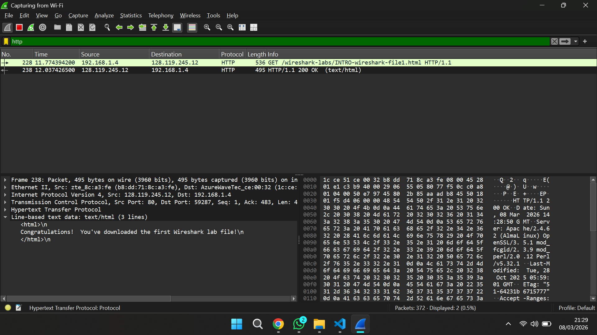

# Laporan Praktikum Jaringan Komputer
## Modul 1 – Running Modul

### 1. Tujuan Praktikum
Praktikum pada modul pertama ini dilaksanakan dengan tujuan untuk memahami bagaimana aturan serta mekanisme pelaksanaan praktikum jaringan komputer. Selain itu, praktikum ini juga bertujuan untuk mengenalkan berbagai tools yang akan digunakan selama praktikum serta memastikan bahwa tools tersebut telah terpasang dan dapat dijalankan dengan baik pada komputer praktikan.

### 2. Dasar Teori
Dalam kegiatan analisis jaringan komputer, dibutuhkan beberapa aplikasi pendukung untuk membantu mengamati lalu lintas data yang terjadi pada jaringan. Salah satu aplikasi yang sering digunakan adalah Wireshark. Wireshark merupakan software yang berfungsi untuk menangkap paket data yang melewati jaringan dan menampilkannya sehingga dapat dianalisis lebih lanjut.
Selain menggunakan Wireshark, praktikum jaringan komputer juga memanfaatkan bahasa pemrograman Python. Bahasa pemrograman ini digunakan dalam beberapa modul untuk menjalankan program maupun melakukan simulasi yang berkaitan dengan jaringan komputer.
Sebelum praktikum dimulai, penting bagi praktikan untuk memastikan bahwa seluruh tools yang dibutuhkan telah berhasil diinstal pada perangkat yang digunakan agar proses praktikum dapat berjalan tanpa kendala.

### 3. Alat dan Bahan
Adapun alat dan bahan yang digunakan pada praktikum ini adalah sebagai berikut:
* Komputer atau laptop
* Aplikasi Wireshark
* Python

### 4. Langkah Percobaan
Tahapan yang dilakukan selama praktikum antara lain:
1. Praktikan terlebih dahulu mendengarkan penjelasan dari asisten praktikum mengenai tata tertib dan sistem pelaksanaan praktikum.
2. Asisten juga menjelaskan modul-modul yang akan dipelajari selama satu semester praktikum jaringan komputer.
3. Selanjutnya praktikan memastikan bahwa tools yang diperlukan telah terpasang pada komputer, yaitu Wireshark dan Python.
4. Setelah itu aplikasi Wireshark dijalankan pada komputer praktikan.
5. Praktikan kemudian mengamati tampilan awal Wireshark serta beberapa fitur dasar yang dijelaskan oleh asisten praktikum.

### 5. Hasil dan Pembahasan
Pada praktikum ini dilakukan pengecekan terhadap aplikasi yang akan digunakan selama kegiatan praktikum jaringan komputer. Dua tools utama yang digunakan yaitu Wireshark dan Python.
Hasil percobaan menunjukkan bahwa aplikasi Wireshark dapat dijalankan dengan baik. File dengan format .pcap yang diberikan oleh asisten praktikum juga berhasil dibuka menggunakan Wireshark. Pada tampilan aplikasi tersebut terlihat berbagai paket data yang tertangkap di jaringan, lengkap dengan informasi seperti waktu paket diterima, alamat sumber, alamat tujuan, serta protokol yang digunakan.
Melalui kegiatan ini praktikan juga mulai mengenal beberapa fitur dasar yang terdapat pada Wireshark yang nantinya akan digunakan pada modul praktikum berikutnya untuk melakukan analisis jaringan.

### 6. Kesimpulan
Dari praktikum yang telah dilakukan dapat disimpulkan bahwa praktikan telah memahami aturan serta sistem pelaksanaan praktikum jaringan komputer. Selain itu, tools yang diperlukan selama praktikum, yaitu Wireshark dan Python, telah berhasil dipasang dan dapat digunakan dengan baik. Praktikan juga memperoleh pemahaman awal mengenai cara kerja Wireshark dalam menangkap dan menampilkan paket data pada jaringan.

### 7. Lampiran
Hasil Percobaan :
