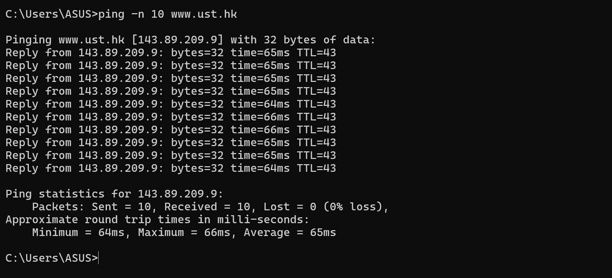
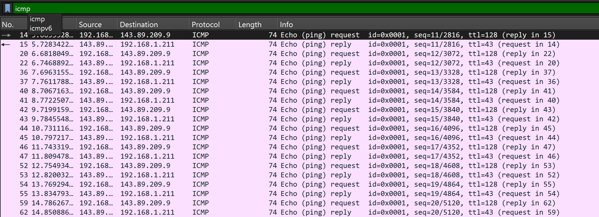
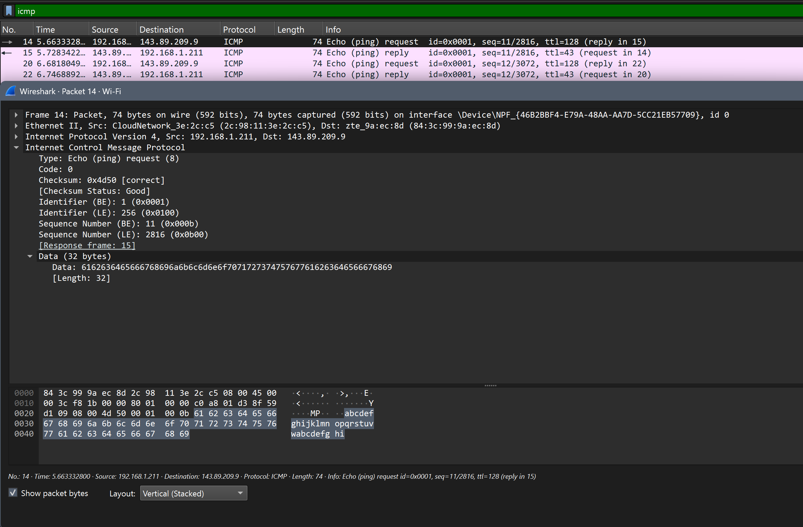
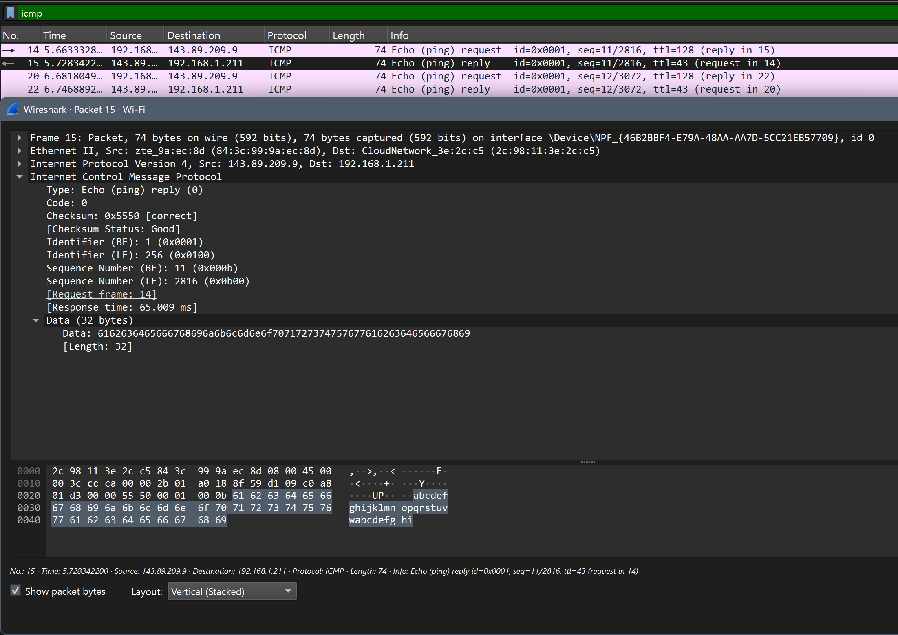
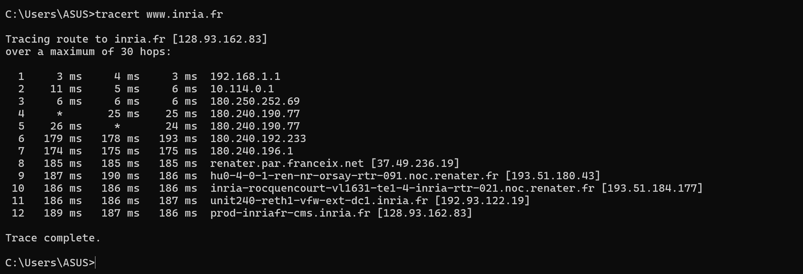
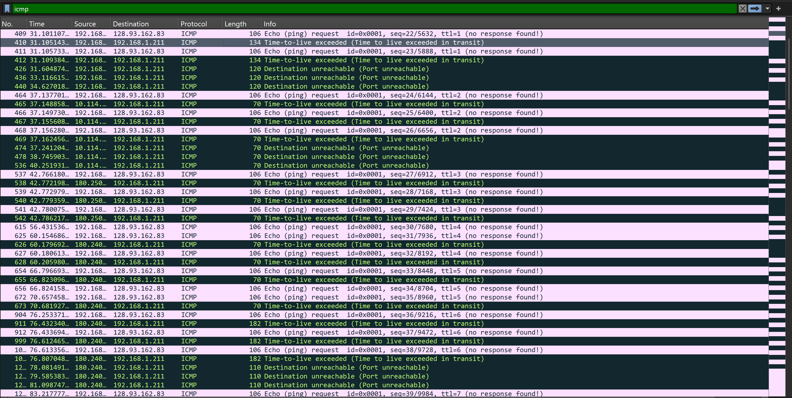
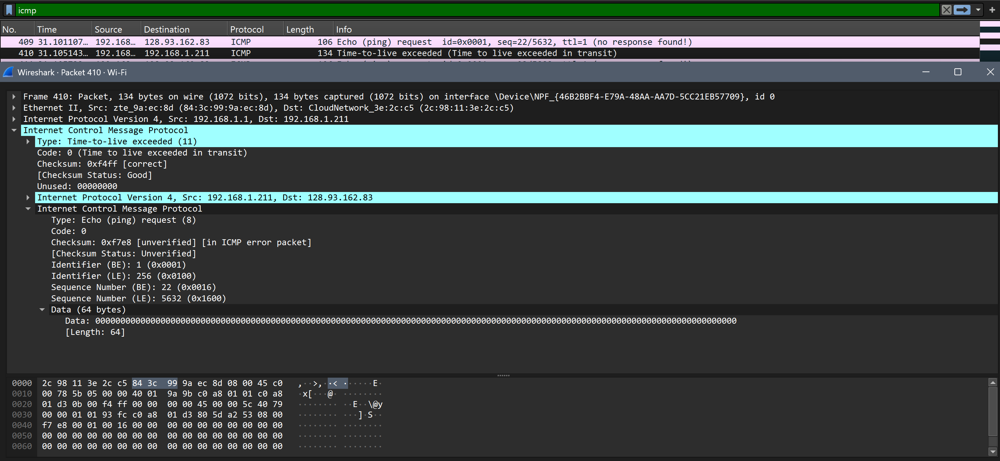

## **LAPORAN PRAKTIKUM MODUL 12**

## ICMP
ICMP (Internet Control Message Protocol) adalah protokol jaringan yang digunakan untuk mengirim pesan kontrol, diagnosa, dan laporan kesalahan antar perangkat di internet. 

**Struktur ICMP terdiri dari:**  
-**Type** -> jenis pesan ICMP  
-**Code** -> detail/error spesifik  
-**Checksum** -> pengecekan error data  
-**Data** -> isi pesan  

**Beberapa tipe ICMP:**  
-**Echo Request** -> permintaan ping  
-**Echo Reply** -> balasan ping  
-**Destination Unreachable** -> tujuan tidak tercapai  
-**Time Exceeded** -> waktu paket habis  
-**Redirect** -> pengalihan rute jaringan  

## Ping 
ping adalah perintah jaringan yang digunakan untuk menguji koneksi antara komputer pengirim dan host tujuan. Perintah ini bekerja dengan mengirim paket ICMP Echo Request ke server atau perangkat tujuan, lalu menunggu balasan berupa ICMP Echo Reply. Jika balasan diterima, berarti koneksi jaringan berhasil dan host dapat dijangkau. Selain itu, ping juga dapat digunakan untuk mengetahui waktu respons atau latency jaringan.

## 🔥 Tahap Implementasi ICMP dan Ping

Gunakan perintah "ping -n 10 www.ust.hk" ntuk mengecek apakah website atau server www.ust.hk dapat dihubungi melalui jaringan internet serta untuk mengetahui kecepatan respons koneksinya

 
 
Berikut tampilan tangkapan paket pada Wireshark:
 
 

 
 

Berdasarkan tangkapan layar di atas, terdapat 20 paket karena perintah menggunakan "-n 10" yaitu sebagai instruksi khusus agar laptop mengirim paket sebanyak 10 kali, dan karena paket terdiri dari **request** dan **reply** sehingga paket dikali dua.
 
 

 
 
Berdasarkan tangkapan layar di atas (Frame 14), terlihat aktivitas protokol ICMP berupa pesan Type 8 Code 0 (Echo ping request) yang dikirim oleh 192.168.1.211 (host) menuju server tujuan 143.89.209.9 dengan nilai TTL = 128. Paket permintaan ini membawa payload data sebesar 32 bytes. 
 
 

 
 
Pada Frame 15, ditangkap paket respons berupa Type 0 Code 0 (Echo ping reply) yang dikirim balik oleh server 143.89.209.9 ke 192.168.1.211 (host). Paket balasan ini merupakan jawaban langsung dari request pada Frame 14, dengan waktu respons (Response time) terukur sebesar 65.009 ms. Server mengirimkan kembali data yang sama persis sebesar 32 bytes dengan nilai TTL sisa = 43, yang membuktikan bahwa paket telah berhasil menempuh perjalanan pulang-pergi melewati beberapa hop jaringan internet tanpa mengalami packet loss.

Sehingga dapat disimpulkan bahwa proses komunikasi di atas berjalan sukses, yang dibuktikan dengan adanya keterkaitan langsung dengan paket balasan pada Frame 15 (Echo ping reply), menandakan adanya konektivitas dua arah yang stabil antara host dan server tujuan.

## Traceroute 
Traceroute adalah teknik atau perintah jaringan yang digunakan untuk melacak jalur perjalanan paket data dari komputer pengirim ke tujuan dengan menampilkan setiap router atau hop yang dilewati selama proses pengiriman data.

Traceroute bekerja berbeda pada tiap sistem operasi. Di Unix/Linux/MacOS, traceroute menggunakan paket UDP dengan nomor port tujuan yang tidak umum, sedangkan di Windows menggunakan paket ICMP. Program ini mengirim paket secara bertahap dengan nilai TTL yang terus meningkat (TTL=1, TTL=2, dan seterusnya). Setiap router yang dilewati akan mengurangi nilai TTL, dan ketika TTL mencapai 1, router akan mengirim pesan error ICMP kembali ke sumber. Dengan cara ini, traceroute dapat menampilkan jalur atau hop yang dilalui paket menuju tujuan.

## 🔥 Tahap Implementasi ICMP dan Traceroute

Gunakan perintah "tracert www.inria.fr" untuk melacak jalur perjalanan paket data dari komputer pengguna menuju server www.inria.fr.

 
 
Berikut tampilan tangkapan paket pada Wireshark:
 
 

 
 

Berdasarkan log paket pada Wireshark, terlihat bahwa perintah "**tracert**" bekerja dengan menaikkan nilai TTL (Time-to-Live) secara bertahap, dimulai dari TTL=1 hingga TTL=7, untuk melacak jalur menuju IP 128.93.162.83. Setiap router yang dilewati akan mengurangi nilai TTL paket. Ketika nilai TTL habis, router akan mengirim balasan ICMP seperti **Type 11 (Time Exceeded)** atau **Type 3 (Destination Unreachable)** ke host pengirim. Dari balasan tersebut, host dapat mengetahui setiap hop atau router yang dilewati paket. setiap hop atau router yang dilewati paket, sehingga jalur jaringan dari komputer lokal menuju server tujuan dapat teridentifikasi secara bertahap.
 
 

 
 

Tangkapan layar di atas merupakan pesan eror ICMP Type 11 (Time-to-live exceeded) yang dapat diidentifikasi melalui kolom Info serta baris **> Type: Time-to-live exceeded (11)** pada detail protokol. Pesan ini dikirim oleh router karena nilai TTL paket telah habis menjadi 0 setelah dikurangi di hop tersebut, yang dibuktikan dengan adanya keterangan **Code: 0 (Time to live exceeded in transit)** tepat di bawahnya, serta dilampirkannya salinan paket Echo Request asli di dalam payload sebagai bukti bahwa paket tersebut telah dihancurkan.
 
## 📝 Kesimpulan
Berdasarkan hasil praktikum, dapat dipahami bahwa protokol ICMP berperan penting dalam proses diagnosa dan pengendalian jaringan komputer. Melalui pengujian menggunakan perintah "**ping**", terbukti bahwa ICMP dapat digunakan untuk mengecek konektivitas antara host dan server tujuan serta mengukur waktu respons jaringan melalui mekanisme Echo Request dan Echo Reply. Selain itu, penggunaan perintah "**tracert**" menunjukkan bahwa proses pelacakan jalur paket dilakukan dengan memanfaatkan peningkatan nilai TTL secara bertahap sehingga setiap hop atau router yang dilewati dapat diketahui melalui balasan ICMP Type 11 maupun Type 3. Dari hasil analisis Wireshark, seluruh proses komunikasi jaringan berhasil diamati secara detail, mulai dari pengiriman paket, balasan server, hingga identifikasi jalur routing menuju server tujuan.