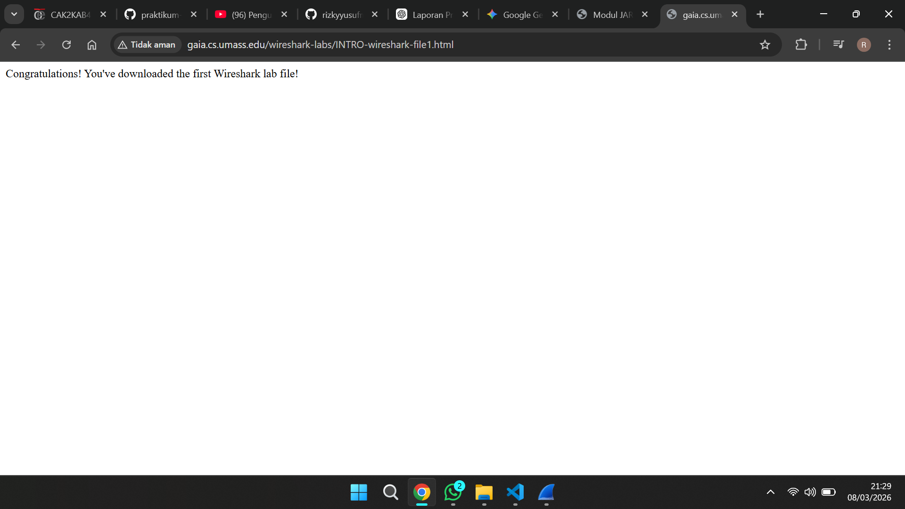

# Laporan Praktikum Jaringan Komputer
## Modul 2 – Pengenalan Tools

---

## 1. Tujuan Praktikum
* **Instalasi Perangkat Lunak:** Mahasiswa mampu mengonfigurasi dan memasang perangkat lunak Wireshark sebagai instrumen utama praktikum.
* **Analisis Lalu Lintas Jaringan:** Mahasiswa diharapkan mahir dalam mengoperasikan fitur penangkapan (*capture*) serta mengklasifikasikan paket data yang melintasi jaringan.

---

## 2. Dasar Teori

**Wireshark** didefinisikan sebagai perangkat *packet analyzer* yang memiliki kapabilitas untuk memantau serta membedah arus data pada sebuah jaringan secara komprehensif. Melalui bantuan aplikasi ini, setiap elemen dalam paket jaringan—mulai dari identitas pengirim/penerima, jenis protokol yang bekerja, hingga muatan informasi di dalamnya—dapat dipetakan dengan jelas.

Mekanisme kerja alat ini bersifat **non-intrusi** atau pasif, yang berarti hanya sekadar merekam dan menyajikan data tanpa melakukan modifikasi pada paket asli. Secara hierarki, data yang terjaring mencakup berbagai *layer* protokol, di antaranya Ethernet, IP, TCP/UDP, hingga protokol pada level aplikasi seperti HTTP.

Berikut adalah komponen fungsional yang menyusun antarmuka Wireshark:
* **Command Menu**: Navigasi utama untuk mengontrol fungsionalitas aplikasi.
* **Packet List Window**: Panel yang merangkum seluruh paket hasil penangkapan.
* **Packet Details Window**: Ruang deskripsi untuk membedah rincian protokol pada paket tertentu.
* **Packet Contents Window**: Representasi data dalam format mentah (ASCII/Heksadesimal).
* **Display Filter**: Fitur penyaringan untuk memisahkan paket berdasarkan spesifikasi protokol.

Integrasi Wireshark dalam studi jaringan memungkinkan pemahaman yang lebih mendalam mengenai interaksi antarlapisan protokol secara langsung.

---

## 3. Langkah Percobaan

1. Melakukan pemasangan aplikasi **Wireshark** pada sistem komputer.
2. Membuka jendela aplikasi utama Wireshark.
3. Mengidentifikasi dan memilih kartu jaringan (*interface*) yang sedang aktif, seperti WiFi atau Ethernet.
4. Memulai sesi perekaman data dengan mengeklik instruksi *Start*.
5. Menjalankan peramban untuk mengakses tautan: 
   "http://gaia.cs.umass.edu/wireshark-labs/INTRO-wireshark-file1.html"
6. Menuntaskan proses *capture* tepat setelah konten halaman web selesai dimuat.
7. Mengaplikasikan **display filter** dengan memasukkan parameter:
   `http`

8. Melakukan observasi terhadap transmisi pesan **HTTP GET** yang dikirimkan klien menuju server.
9. Menelaah arsitektur paket melalui panel **packet details**.
10. Menutup aplikasi setelah seluruh data diobservasi.

---

## 4. Hasil Pengamatan

Berdasarkan aktivitas perekaman yang dilakukan, ditemukan beragam tipe paket yang berhasil diamankan oleh Wireshark, mencakup protokol TCP, DNS, serta HTTP.

Setelah parameter filter **http** diaktifkan, tampilan aplikasi menjadi lebih fokus dan hanya menyisakan paket-paket berbasis HTTP. Dalam tahap ini, ditemukan jejak komunikasi berupa **HTTP GET** (permintaan dari browser) serta **HTTP Response** (jawaban dari pihak server).

Pemeriksaan pada panel detail mengungkap struktur protokol yang tersusun secara sistematis, yaitu:
- *Layer* Ethernet (Data Link)
- *Layer* Internet Protocol / IP (Network)
- *Layer* Transmission Control Protocol / TCP (Transport)
- *Layer* Hypertext Transfer Protocol / HTTP (Application)

---

## 5. Analisis

Melalui eksperimen ini, terlihat bahwa Wireshark memiliki efektivitas tinggi dalam menyajikan visibilitas aktivitas jaringan. Saat sebuah situs web diakses, terjadi pertukaran data yang sangat terorganisir antara permintaan dari sisi klien dan respon dari server.

Penting untuk diperhatikan bahwa komunikasi ini tidak berdiri sendiri; protokol tambahan seperti DNS dan TCP turut bekerja di balik layar. Ketersediaan fitur penyaringan (*filter*) menjadi krusial untuk mempermudah identifikasi protokol spesifik di tengah tumpukan trafik yang padat. Secara keseluruhan, praktikum ini memperlihatkan bahwa setiap komunikasi digital merupakan kumpulan paket data yang saling berinteraksi secara berkelanjutan.

---

## 6. Kesimpulan

1. Wireshark terbukti sebagai instrumen yang handal untuk kebutuhan pemantauan dan analisis lalu lintas data jaringan.
2. Setiap transmisi informasi di dalam jaringan terdiri atas lapisan-lapisan protokol yang saling terintegrasi (Ethernet, IP, TCP, hingga HTTP).
3. Efisiensi pencarian data dapat ditingkatkan melalui fitur filter guna mengisolasi jenis protokol tertentu.
4. Praktikum ini memberikan gambaran nyata mengenai bagaimana mekanisme komunikasi antarperangkat terjadi melalui pertukaran unit informasi dalam bentuk paket.