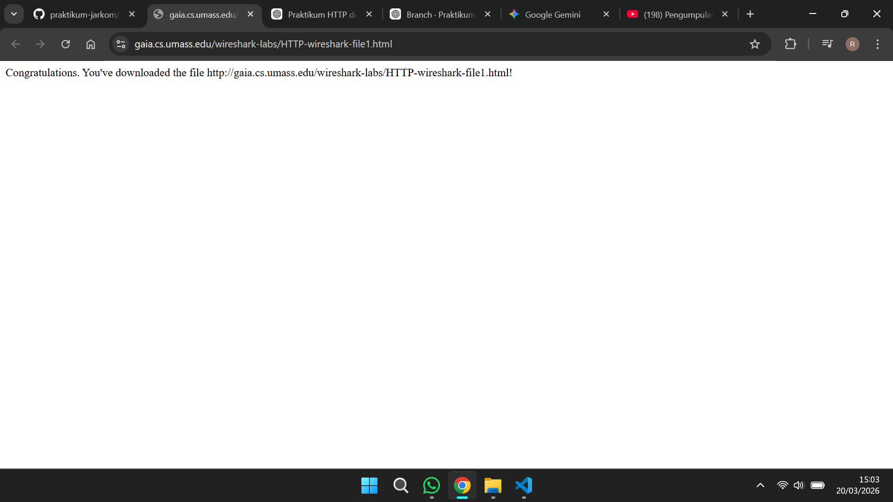
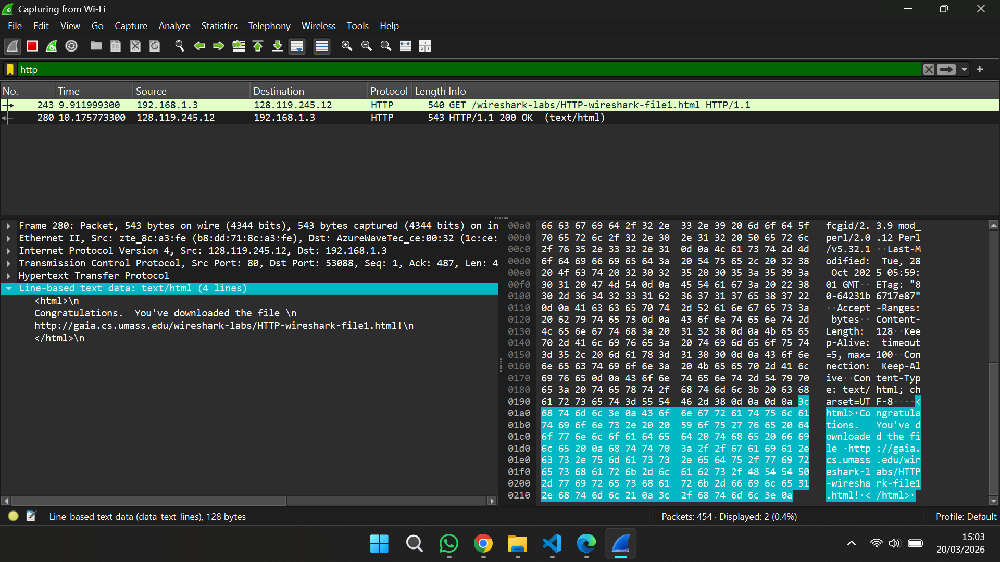
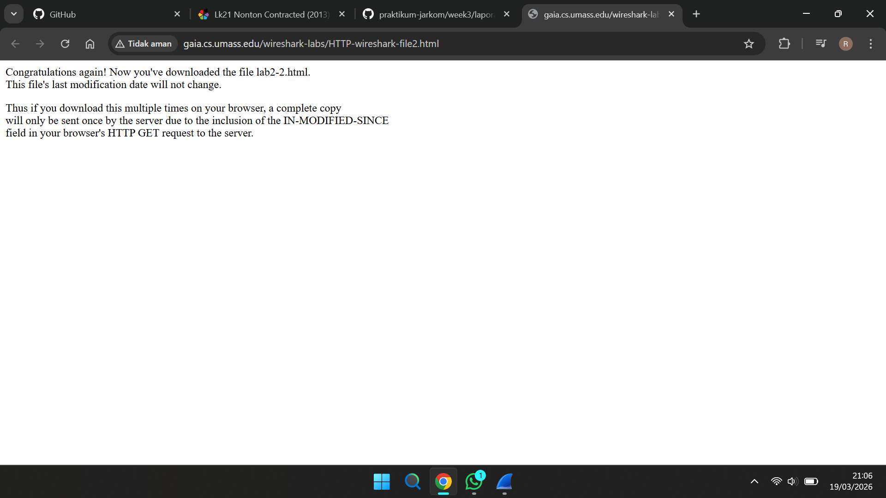
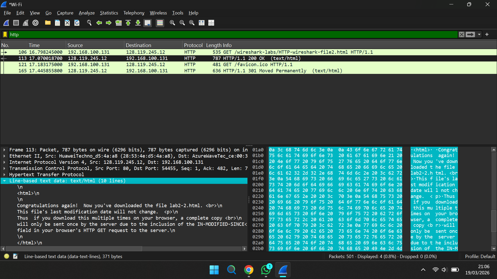
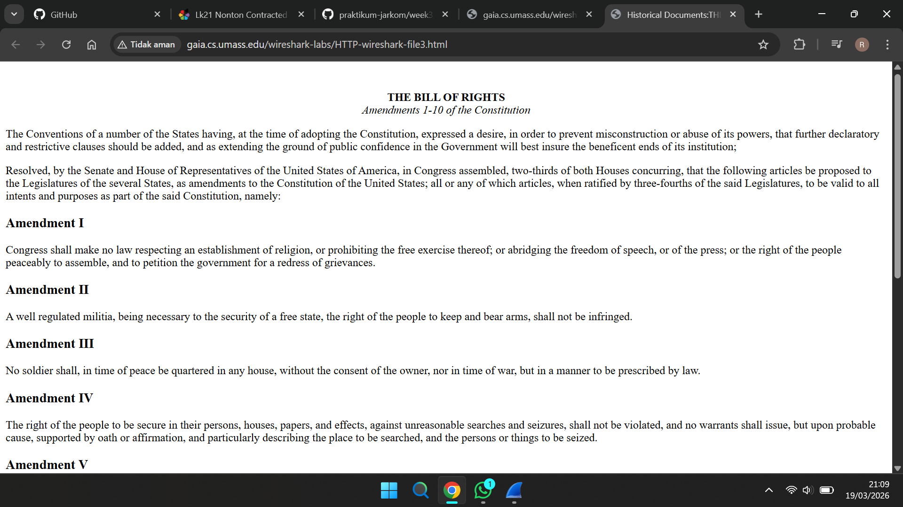
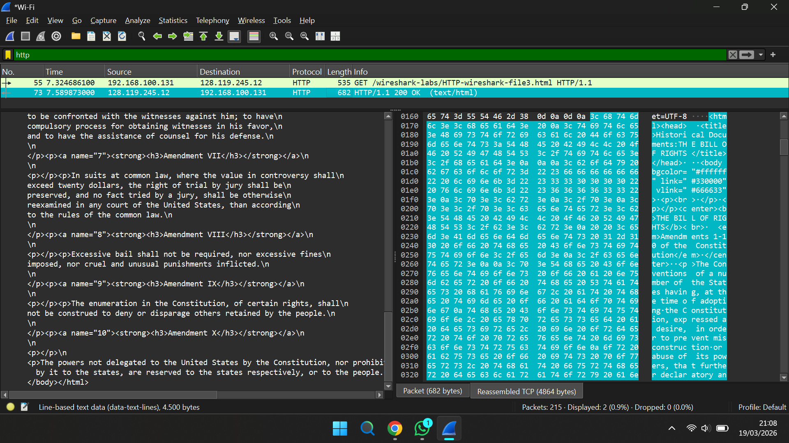
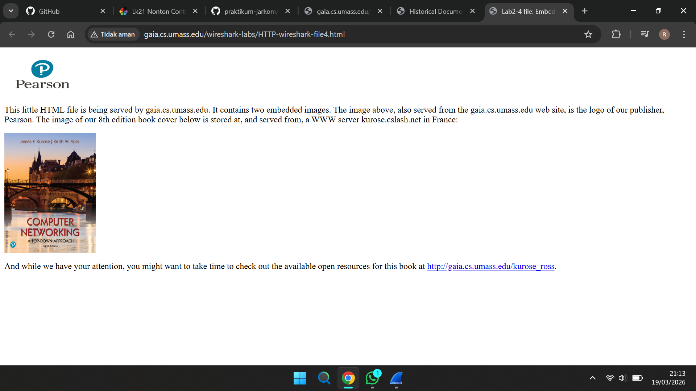
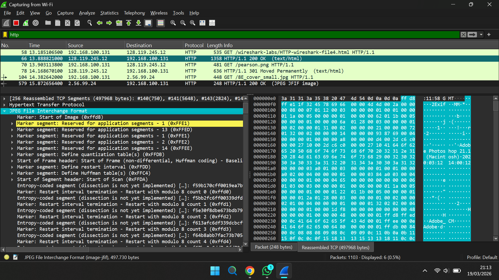
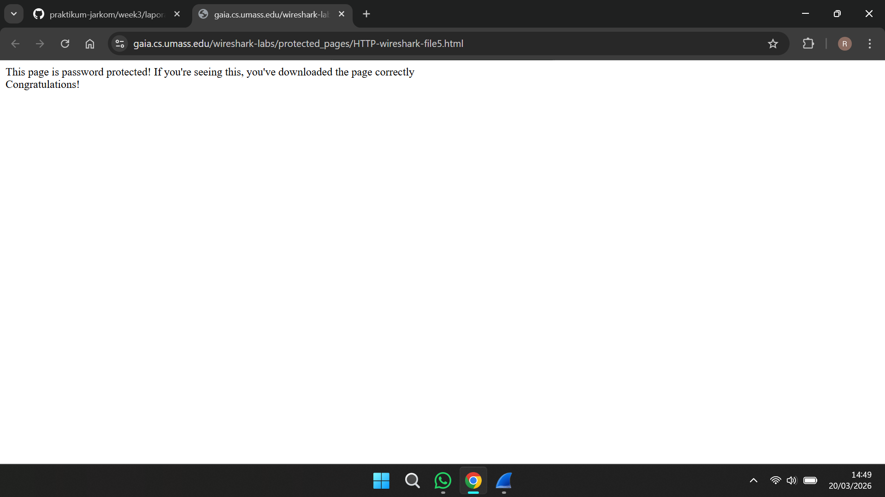
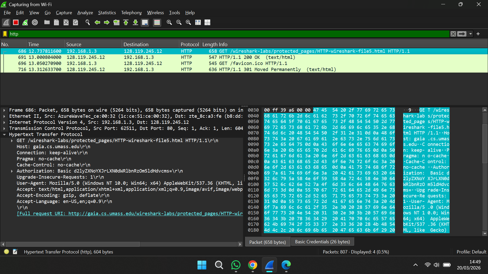

## 1. Tujuan Praktikum  
Praktikum ini bertujuan agar mahasiswa dapat memahami serta menganalisis cara kerja protokol HTTP dengan menggunakan aplikasi Wireshark.

---

## 2. Dasar Teori  

HTTP (Hypertext Transfer Protocol) merupakan protokol pada layer aplikasi yang digunakan untuk komunikasi antara client (browser) dan server web.

Metode utama dalam HTTP:
- **GET** → digunakan untuk mengambil data dari server  
- **POST** → digunakan untuk mengirim data ke server  

Karakteristik HTTP:
- Bersifat stateless (tidak menyimpan sesi)
- Menggunakan mekanisme request dan response
- Berjalan di atas protokol TCP  

Wireshark adalah aplikasi yang digunakan untuk menangkap dan menganalisis paket data yang berjalan di jaringan, termasuk HTTP.

---

## Basic HTTP GET/Response Interaction  

Pada percobaan awal dilakukan akses ke halaman HTML sederhana tanpa elemen tambahan.

### Langkah-langkah:
1. Membuka browser  
2. Mengakses URL berikut menggunakan HTTP:  
   http://gaia.cs.umass.edu/wireshark-labs/HTTP-wireshark-file1.html  
   
3. Menghentikan proses capture setelah halaman tampil  

### Hasil:
Terlihat dua jenis pesan:
- HTTP GET request dari browser ke server  
- HTTP response dari server ke browser  

Wireshark juga menampilkan informasi dari layer TCP, IP, dan Ethernet.

---

## HTTP Conditional GET/Response Interaction  

Percobaan ini bertujuan untuk melihat penggunaan cache oleh browser.

### Langkah-langkah:
1. Menghapus cache dan history browser  
2. Memulai capture di Wireshark  
3. Mengakses:  
   http://gaia.cs.umass.edu/wireshark-labs/HTTP-wireshark-file2.html
   
4. Melakukan refresh halaman  
5. Menghentikan capture dan menggunakan filter `http`  

### Hasil:
Browser tidak selalu meminta ulang seluruh data karena dapat memanfaatkan cache yang sudah ada.

---

## Retrieving Long Documents  

Percobaan ini mengamati proses pengambilan file HTML berukuran besar.

### Langkah-langkah:
1. Membersihkan cache browser  
2. Memulai capture di Wireshark  
3. Mengakses:  
   http://gaia.cs.umass.edu/wireshark-labs/HTTP-wireshark-file3.html 
    
4. Menghentikan capture setelah halaman tampil  

### Hasil:
Data dikirim dalam beberapa segmen TCP karena ukuran file besar, lalu disusun kembali menjadi satu oleh Wireshark.

---

## HTML dengan Embedded Objects  

Percobaan ini melihat bagaimana browser mengambil objek tambahan seperti gambar.

### Langkah-langkah:
1. Membersihkan cache dan memulai capture  
2. Mengakses:  
   http://gaia.cs.umass.edu/wireshark-labs/HTTP-wireshark-file4.html  
   
3. Menghentikan capture setelah halaman dimuat  

### Hasil:
Browser mengirim request tambahan untuk setiap objek (misalnya gambar) yang ada di dalam halaman HTML.

---

## HTTP Authentication  

Percobaan ini mengamati proses login menggunakan HTTP.

### Langkah-langkah:
1. Memulai capture di Wireshark  
2. Mengakses:  
   http://gaia.cs.umass.edu/wireshark-labs/protected_pages/HTTP-wireshark-file5.html  
   
3. Memasukkan:
   - Username: wireshark-students  
   - Password: network  
4. Menghentikan capture dan menggunakan filter `http`  

### Hasil:
Data login dapat terlihat pada paket karena tidak adanya enkripsi (plain text).

---

## Risiko Keamanan HTTP  

HTTP tidak memiliki sistem enkripsi sehingga data yang dikirim dapat disadap oleh pihak lain.  

Sebagai solusi, digunakan HTTPS yang menambahkan keamanan melalui SSL/TLS sehingga data terenkripsi.

---

## Kesimpulan  

Dari praktikum ini dapat disimpulkan bahwa komunikasi HTTP berlangsung melalui mekanisme request dan response antara client dan server.  

Jika sebuah halaman memiliki banyak objek tambahan, browser akan mengirim beberapa request untuk mengambil setiap objek tersebut. Untuk file berukuran besar, data dikirim dalam beberapa segmen TCP sebelum digabung kembali.  

Selain itu, HTTP memiliki kelemahan dalam hal keamanan karena data dikirim tanpa enkripsi, sehingga penggunaan HTTPS menjadi solusi yang lebih aman.